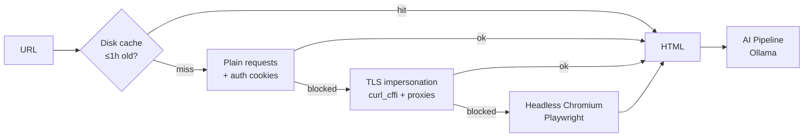

<div align="center">

# 🔍 DeepScrape

### AI-Powered Web Scraper & Document Intelligence Platform

**Scrape any site → harvest documents → ask AI anything about them.** Runs 100% locally.

[](https://github.com/SummitAnthony/DeepScrape-AI-Powered-Scraper/actions/workflows/tests.yml)


</div>

---

DeepScrape started as a simple PDF downloader and grew — across five test-driven build rounds — into a full document-intelligence toolkit. It fetches even bot-protected and login-walled pages, harvests PDFs/DOCX/XLSX/CSV, and lets you **chat with what it finds** using a local LLM. No API keys, no cloud, nothing leaves your machine.

Use it three ways: a **Streamlit web app**, a **REST API**, or a **command-line tool**.

## ✨ Highlights

- 🧠 **Chat with your documents** — RAG over harvested files with source citations and multi-turn memory
- 👁️ **Vision analysis** — screenshots a page and reads its charts, images, and layout with a vision model
- 🛡️ **Gets past defenses** — TLS-fingerprint impersonation, proxy rotation, and cookie/header auth for login-walled pages
- 🕸️ **Smart crawling** — the AI decides which links to follow toward *your* goal; or ingest a whole site via `sitemap.xml`
- 📊 **Structured extraction** — turn any page into a table (name, price, date…) with a majority-vote "tournament" mode for accuracy
- 🔔 **Hands-free monitoring** — watch pages on a schedule and get Slack/Discord alerts when they change
- 🔒 **Fully local & private** — all AI runs through [Ollama](https://ollama.ai/) on your own hardware

## 🏗️ How It Works

Every page fetch cascades through a four-tier pipeline — it only escalates to a heavier tier when the lighter one is blocked, so static pages are instant and hard pages still get through:



## 🚀 Quick Start

```bash
# 1. Clone & install
git clone https://github.com/SummitAnthony/DeepScrape-AI-Powered-Scraper.git
cd DeepScrape-AI-Powered-Scraper
pip install -r requirements.txt
playwright install chromium

# 2. Install a local model (for AI features)
#    Get Ollama from https://ollama.ai, then:
ollama pull llama3
ollama pull nomic-embed-text   # for RAG chat

# 3. Launch the web app
streamlit run main.py
```

## 🖥️ Three Ways to Use It

**Web app** — the full experience with live-streaming AI, RAG chat, and visual analysis:
```bash
streamlit run main.py
```

**Command line** — drive the pipeline from your terminal, pipe JSON anywhere:
```bash
python cli.py scrape  https://example.com
python cli.py pdfs    https://example.com
python cli.py extract https://example.com --fields "name,price,date"
```

**REST API** — integrate DeepScrape into any app or script:
```bash
uvicorn api:app          # interactive docs at http://localhost:8000/docs
```
```bash
curl -X POST localhost:8000/extract \
  -H "Content-Type: application/json" \
  -d '{"url": "https://example.com", "fields": ["name", "price"]}'
```

## 🧩 Full Feature Set

### Fetching & Access
- **Four-tier pipeline** — cache → requests → TLS impersonation → headless Chromium (Playwright)
- **Anti-bot resilience** — `curl_cffi` Chrome TLS fingerprint + per-request proxy rotation via `proxies.txt`
- **Authenticated scraping** — drop a `cookies.json` (`{"cookies": {...}, "headers": {...}}`), injected across every tier
- **Page caching** — scraped pages cached on disk (1h TTL) so re-analysis is instant

### Discovery & Harvesting
- **Deep crawl** — follow same-domain links to depth 3, respecting `robots.txt`
- **AI smart crawl** — give a goal ("find 2024 exam papers") and the LLM ranks which links to follow
- **Sitemap ingestion** — read `sitemap.xml` (incl. nested indexes) for instant whole-site URL discovery
- **Multi-format harvesting** — download **PDF, DOCX, XLSX, CSV** concurrently, all extractable for AI

### AI Intelligence (100% local via Ollama)
- **Chat with content or documents** — live-streaming answers, any installed model
- **RAG chat** — chunk → embed → SQLite vector store → **cited answers** with multi-turn memory
- **Map-reduce analysis** — oversized content is chunked, analyzed, and merged automatically
- **Structured extraction** — fields → JSON → table with CSV/JSON export, plus **tournament mode** (extract 3×, majority-vote for accuracy)
- **Visual analysis** — full-page screenshot analyzed by a vision model (llava) for charts & layout

### Automation & Monitoring
- **Watch mode** — snapshot a page and diff added/removed content between checks
- **Scheduled runner** — `python watch_runner.py` batch-checks all watched URLs (cron / Task Scheduler friendly)
- **Webhook alerts** — set `DEEPSCRAPE_WEBHOOK_URL` for Slack/Discord/generic notifications on change
- **Scrape history** — every job logged to SQLite with one-click re-run in the UI

## 🧪 Built Test-First

DeepScrape was developed across **5 iterative build rounds**, every feature shipped red-green TDD:

| | |
|---|---|
| ✅ **153 tests** | across 18 test suites, all passing |
| 🔄 **CI on every push** | GitHub Actions runs the full suite |
| 📦 **12 focused modules** | clean separation: fetch, parse, RAG, vision, watch, API, CLI |

```bash
python -m pytest -q      # run the full suite
```

## 📁 Project Structure

```
DeepScrape-AI-Powered-Scraper/
├── main.py            # Streamlit web app (all features)
├── cli.py             # Command-line interface
├── api.py             # FastAPI REST server
├── scrape.py          # Four-tier fetch pipeline, crawler, sitemap, downloads
├── parse.py           # Ollama: streaming, map-reduce, structured + tournament extraction
├── rag.py             # RAG: chunking, embeddings, SQLite vector store, cited answers
├── vision.py          # Screenshot + vision-model analysis
├── conversation.py    # Multi-turn chat memory (budget-trimmed)
├── watch.py           # Page snapshots + change diffing
├── watch_runner.py    # Scheduled batch watcher
├── notify.py          # Slack/Discord/generic webhook alerts
├── history.py         # Scrape-history job log
├── tests/             # 18 pytest suites (153 tests)
└── requirements.txt
```

## 🔧 Requirements

- **Python 3.8+** · Windows, macOS, or Linux
- **[Ollama](https://ollama.ai/)** with at least one model pulled (for AI features)
- Playwright manages its own headless Chromium — **no Chrome/ChromeDriver install needed**

## 🩹 Troubleshooting

| Symptom | Fix |
|---|---|
| Browser / "executable doesn't exist" errors | `playwright install chromium` |
| AI features not responding | Ensure `ollama serve` is running and a model is pulled |
| RAG chat indexing fails | Pull the embedding model: `ollama pull nomic-embed-text` |
| Visual analysis fails | Pull a vision model: `ollama pull llava` |

## 🤝 Contributing

Contributions welcome — please open an issue or PR. Run `python -m pytest -q` before submitting.

## 📄 License

MIT — see [LICENSE](LICENSE).

## 🙏 Acknowledgments

[Ollama](https://ollama.ai/) · [Playwright](https://playwright.dev/) · [Streamlit](https://streamlit.io/) · [FastAPI](https://fastapi.tiangolo.com/)

<div align="center">
<sub>Built locally, runs locally, your data stays yours.</sub>
</div>
